# Jarkom-Modul-1-B07-2023
> Laporan Resmi Praktikum 1 Jaringan Komputer B07
***
## Anggota Kelompok B07
1. I Gusti Ngurah Ervan Juli Ardana (5025211295)
2. Danar Sodik Priyambodo (5025211145)

## Daftar isi
+ [SOAL 1](#soal-1)
+ [SOAL 2](#soal-2)
+ [SOAL 3](#soal-3)
+ [SOAL 4](#soal-4)
+ [SOAL 5](#soal-5)
+ [SOAL 6](#soal-6)
+ [SOAL 7](#soal-7)
+ [SOAL 8](#soal-8)
+ [SOAL 9](#soal-9)
+ [SOAL 10](#soal-10)
+ [SOAL 11](#soal-11)
+ [SOAL 12](#soal-12)
+ [SOAL 13](#soal-13)
+ [SOAL 14](#soal-14)
+ [SOAL 15](#soal-15)
+ [SOAL 16](#soal-16)
+ [SOAL 17](#soal-17)
+ [SOAL 18](#soal-18)
+ [SOAL 19](#soal-19)
+ [SOAL 20](#soal-20)

---
## SOAL 1
### Pertanyaan
Yudhistira akan digunakan sebagai DNS Master, Werkudara sebagai DNS Slave, Arjuna merupakan Load Balancer yang terdiri dari beberapa Web Server yaitu Prabakusuma, Abimanyu, dan Wisanggeni. Buatlah topologi dengan pembagian sebagai berikut. Folder topologi dapat diakses pada drive berikut 

### Solusi
Pertama tama kita hanya perlu menyalin topology yang telah diberikan pada link drive diatas, jadinya akan seperti gambar dibawah ini


Setelah berhasil menyalin topology tersebut, kita perlu mengatur konfigurasi masing masing node yang telah ada :


<br>


Setelah berhasil memeriksa membuat konfigurasinya dan memeriksa semua ip, kami lanjut menambahkan `iptables -t nat -A POSTROUTING -o eth0 -j MASQUERADE -s 10.12.0.0/16` kepada router pandudewenata dengan meletakan pada /root/.bashrc Kemudian kita memeriksa IP DNS dari router Pandudewenata dan mencatat IP tersebut. IP yang didapatkan yaitu 192.168.122.1 Setelah itu kita perlu memasukan node ini pada masing masing node yang ada 

`iptables -t nat -A POSTROUTING -o eth0 -j MASQUERADE -s 10.12.0.0/16` 

dan

`echo nameserver 192.168.122.1 > /etc/resolv.conf`

Kemudian kami coba ping google pada masing masing node. Hasil akhirnya kami bisa melakukan ping pada masing masing node tersebut


---
## SOAL 2
### Pertanyaan
Buatlah website utama pada node arjuna dengan akses ke arjuna.yyy.com dengan alias www.arjuna.yyy.com dengan yyy merupakan kode kelompok.

### Solusi
untuk membuat website utama pertama tama kita harus melakukan update dan isntall bind9 pada node yudhistira. Setelah itu kita harus mengubah named.conf.local yang ada pada direktori bind dengan command berikut `nano /etc/bind/named.conf.local` ubah agar menjadi seperti ini


Kemudian kita membuat 1 folder bernama jarkom dengan command `mkdir /etc/bind/jarkom`. Selanjutnya kita harus salin file db.local pada path /etc/bind ke dalam folder jarkom yang baru saja dibuat dengan  `cp /etc/bind/db.local /etc/bind/jarkom/arjuna.b07.com` kemudian kami membuka file arjuna.b07.com dan mengubah beberapa bagian menjadi:


Kemudian kita melakukan restart bin dengan perintah : `service bind9 restart` dan merubah settingan nameserver yang ada pada nakula dan sadewa dengan mengganti name server pada  `nano /etc/resolv.conf`


Terakhir kami melakukan testing dengan perintah `ping arjuna.b07.com` -c 5 dan `ping www.arjuna.b07.com`


---
## SOAL 3
### Pertanyaan
Dengan cara yang sama seperti soal nomor 2, buatlah website utama dengan akses ke abimanyu.yyy.com dan alias www.abimanyu.yyy.com.

### Solusi
soal ini hampir sama dengan soal sebelumnya, pertama kita perlu mengubah named.conf.local dengan perintah `nano /etc/bind/named.conf.local`


Kemudian kami membuat 1 folder bernama abimanyu dengan : `mkdir /etc/bind/abimanyu`. Lalu, sama seperti sebelumnya dengan copy file db.local dengan `cp /etc/bind/db.local /etc/bind/abimanyu/abimanyu.b07.com` dan buka file abimanyu yang telah di copy, kemudian sesuaikan isinya


Selanjutnya kami perlu melakukan restart bin dengan perintah : `service bind9 restart` dan mengubah settingan nameserver pada nakula dan sadewa (client) dengan mengganti name server pada  nano `/etc/resolv.conf` yang diisi dengan ip yudhistira. Terakhir, sama seperti sebelumnya kami melakukan testing dengan perintah `ping abimanyu.b07.com -c 5` dan `ping www.abimanyu.b07.com`


---
## SOAL 4
### Pertanyaan
Kemudian, karena terdapat beberapa web yang harus di-deploy, buatlah subdomain parikesit.abimanyu.yyy.com yang diatur DNS-nya di Yudhistira dan mengarah ke Abimanyu.

### Solusi
pertama tama pada yudhistira, buka `nano /etc/bind/abimanyu/abimanyu.com` Tambahkan konfigurasi seperti berikut untuk menambahkan subdomain


dengan konfigurasi diatas, maka akan menambahkan domain dengan nama parikesit yang juga akan mengarah ke ip abimanyu. Kemudian lakukan restart bind “service bind9 restart”
dan kami melakukan pengetesan untuk melakukan ping pada subdomain


---
## SOAL 5
### Pertanyaan
Buat juga reverse domain untuk domain utama. (Abimanyu saja yang direverse)

### Solusi
Pertama tama, edit named.conf.local dengan membuka `nano /etc/bind/named.conf.local` kemudian kami menambahkan konfigurasi untuk melakukan reverse domain utama yaitu abimanyu, perlu diketahui bahwa ip abimanyu kelompok kita adalah 10.12.3.3 maka akan di reverse menjadi 3.3.12.10. tanpa ip keempat


sama seperti sebelumnya dengan copy file db.local dengan `cp /etc/bind/db.local /etc/bind/abimanyu/3.12.10.in-addr.arpa` kami melakukan perubahan pada file 3.12.10.in-addr.arpa menjadi seperti gambar di bawah ini


kemudian kami harus melakukan restart `service bind9 restart`
untuk melakukan pengecekan konfigurasi maka pada client (nakula/sadewa) bisa dilakukan download dengan nameserver awal dulu (192.168.122.1) agar terhubung ke internet untuk melakukan apt-get update dan juga apt-get install dnsutils. Setelah proses download selesai maka ubah nameserver ke arah yudhistira untuk melakukan cek konfigurasi dengan command `host -t PTR 10.12.3.3` (ip abimanyu) dan apabila berhasil maka akan muncul output seperti ini 


---
## SOAL 6
### Pertanyaan
Agar dapat tetap dihubungi ketika DNS Server Yudhistira bermasalah, buat juga Werkudara sebagai DNS Slave untuk domain utama.

### Solusi
kami melakukan edit pada `/etc/bind/named.conf.local` di yudhistira dan sesuaikan dengan syntax berikut


kita mengubah pada kedua dns, kemudian lakukan 
```
service bind9 restart
```
selanjutnya kita melakukan setting pada dns slave yaitu werkudara dengan mengunduh bind9 dengan cara 
```
apt-get update
``` 
kemudian
```
apt-get install bind9 -y
``` 
dan selanjutnya menambahkan pada `/etc/bind/named.conf.local` pada werkudara dengan


dengan kedua dns, karena kita mengubah pada keduanya. kemudian lakukan 
```
service bind9 restart
```
lakukan
```
service bind9 stop
```
pada yudhistira untuk melakukan cek apakah bisa mengakses melalui dns slave yang sudah dibuat. pada client (nakula/sadewa) masukkan 2 nameserver yaitu ip dari yudhistira dan juga ip dari werkudara dengan 
```
nano /etc/resolv.conf
```


kita melakukan ping ke kedua dns pada client sadewa. dan ping berhasil meskipun bind9 pada yudhistira di stop yang berarti konfigurasi dns slave berhasil


---
## SOAL 7
### Pertanyaan
Seperti yang kita tahu karena banyak sekali informasi yang harus diterima, buatlah subdomain khusus untuk perang yaitu baratayuda.abimanyu.yyy.com dengan alias www.baratayuda.abimanyu.yyy.com yang didelegasikan dari Yudhistira ke Werkudara dengan IP menuju ke Abimanyu dalam folder Baratayuda.

### Solusi
Kita melakukan konfigurasi untuk kasus ini adalah delegasi subdomain, Pada yudhistira kita melakukan edit file `/etc/bind/abimanyu/abimanyu.b07.com` dan mengubah menjadi seperti di bawah ini


keterangan ns untuk delegasi subdomain yang dimana baratayuda adalah subdomain yang akan didelegasikan. Kemudian kita melakukan edit file `/etc/bind/named.conf.options`


melakukan comment pada `dnssec-validation auto;` dan menambahkan `allow-query{any;};`
kemudian pada `/etc/bind/named.conf.local`


menambahkan allow-transfer dengan ip werkudara, namun sebelumnya sudah di set jadi tidak dilakukan perubahan karena sudah sesuai
lakukan
```
service bind9 stop
```
Pada Werkudara edit file `/etc/bind/named.conf.options` sama persis seperti poin nomor 3 dengan melakukan comment pada `dnssec-validation auto;` dan menambahkan `allow-query{any;};`


lalu kami melakukan edit file `/etc/bind/named.conf.local` pada werkudara menjadi seperti


sesuai ketentuan dengan folder baratayuda. buat directory sesuai folder 
```
mkdir /etc/bind/baratayuda
```
kemudian kita melakukan copy pada db.local dengan 
```
cp /etc/bind/db.local /etc/bind/baratayuda/baratayuda.abimanyu.b07.com
```
kemudian kita melakukan edit pada file `baratayuda.abimanyu.b07.com`


dengan menambahkan alias www pada dns tersebut dan sesuai ketentuan dengan ip mengarah ke abimanyu. lakukan
```
service bind9 stop
```
kita melakukan testing pada client (nakula/sadewa) pada delegasi subdomain yang telah dilakukan dengan dan tanpa alias (www)


---
## SOAL 8
### Pertanyaan
Untuk informasi yang lebih spesifik mengenai Ranjapan Baratayuda, buatlah subdomain melalui Werkudara dengan akses rjp.baratayuda.abimanyu.yyy.com dengan alias www.rjp.baratayuda.abimanyu.yyy.com yang mengarah ke Abimanyu.

### Solusi
pada kasus ini kita melakukan pemberian subdomain namun pada subdomain hasil delegasi sebelumnya dengan menambahkan rjp.dan alias www. kita melakukan perubahan pada file `baratayuda.abimanyu.b07.com` dengan
```
nano /etc/bind/baratayuda/baratayuda.abimanyu.b07.com
```


disini kita menambahkan subdomain sesuai ketentuan yaitu subdomain rjp dan memberikan alias www.rjp untuk CNAME yang di set menuju subdomain sebelumnya. lakukan
```
service bind9 stop
```
kita melakukan test ping dengan subdomain dan alias yang diberikan


---
## SOAL 9
### Pertanyaan
Arjuna merupakan suatu Load Balancer Nginx dengan tiga worker (yang juga menggunakan nginx sebagai webserver) yaitu Prabakusuma, Abimanyu, dan Wisanggeni. Lakukan deployment pada masing-masing worker.

### Solusi
pertama-kita akan melakukan setup pada worker, disini kita ada 3 worker yang akan digunakan, yaitu, prabukusuma, abimanyu, dan wisanggeni.


kita install lalu setup Nginx dan PHP pada setiap worker yang digunakan dengan
```
apt-get update && apt install nginx php php-fpm -y
```
buat directory yang sama pada setiap worker dengan nama yang sama agar memudahkan setup dengan nama jarkom dengan cara
```
mkdir /var/www/jarkom
```
buat file index.php dan masukkan file echo seperti pada gambar berikut pada file dengan cara
```
nano index.php
```
pastikan dijalankan pada directory tersebut.


note : bedakan nama “prabukusuma” sesuai dengan lokasi setup.

selanjutnya kita melakukan konfigurasi pada Nginx, masuk ke direktori `/etc/nginx/sites-available` lalu buat file baru dengan nama jarkom atau langsung menggunakan
```
touch /etc/nginx/sites-available/jarkom
```
jalankan
```
nano /etc/nginx/sites-available/jarkom
```
kemudian isikan seperti berikut


dengan memberikan server_name sesuai ip worker yang sedang di setup, dan root sesuai dengan directory yang telah di set sebelumnya. simpan kemudian lakukan sm link dengan cara 
```
ln -s /etc/nginx/sites-available/jarkom /etc/nginx/sites-enabled
```
disini kita mendapati error setelah mencoba yaitu muncul default page, namun kita menambahkan 1 command untuk mengatasi hal tersebut dengan cara 
```
rm -rf /etc/nginx/sites-enabled/default
```
lakukan
```
ervice php7.2-fpm start
```
dan juga lakukan
```
service nginx restart
```
kita melakukan pengecekan pada nginx dengan cara
```
nginx -t
```
dan apabila muncul seperti contoh berikut maka berhasil.


kita lakukan juga pada worker yang lain. kemudian kita melakukan setup pada load balancer yang dimana disini adalah arjuna dengan cara membuat file directory pada `/etc/nginx/sites-available` dengan nama `lb-jarkom` dengan cara
```
touch /etc/nginx/sites-available/lb-jarkom
```
kemudian kita mengisikan sebagai berikut untuk menghandle ketiga worker yang telah di setup sebelumnya


dengan server masing masing dari ip worker yang telah di setup, beri nama juga pada server name untuk akses poin. kita simpan lalu buat symlink dengan cara
```
ln -s /etc/nginx/sites-available/lb-jarkom /etc/nginx/sites-enabled
```
lakukan
```
service nginx restart
```
kita lakukan pengetesan pada client (nakula/sadewa) apakah sudah dapat diakses atau belum dengan menggunakan command
```
lynx arjuna.b07.com
```
dan akan muncul halaman seperti dibawah, yang apabila di refresh (ctrl + r) maka akan berganti ganti halaman antar worker


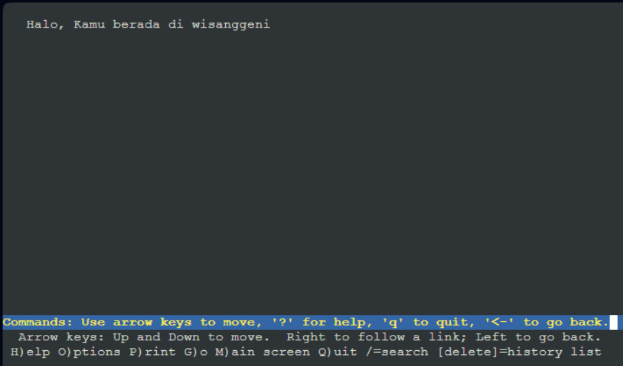

apabila salah satu worker melakukan stop nginx, maka halaman tidak akan muncul

---
## SOAL 10
### Pertanyaan
 Kemudian gunakan algoritma Round Robin untuk Load Balancer pada Arjuna. Gunakan server_name pada soal nomor 1. Untuk melakukan pengecekan akses alamat web tersebut kemudian pastikan worker yang digunakan untuk menangani permintaan akan berganti ganti secara acak. Untuk webserver di masing-masing worker wajib berjalan di port 8001-8003. Contoh
- Prabakusuma:8001
- Abimanyu:8002
- Wisanggeni:8003


### Solusi
pada sebelumnya, karena default kita sudah menggunakan Round Robin pada load balancer Arjuna, disini kita hanya melakukan set port masing masing sesuai ketentuan yang diberikan, akses masing masing file jarkom di worker masing masing pada site available dengan cara
```
nano /etc/nginx/sites-available/jarkom
```
kemudian ubah pada listen sesuai ketentuan dari masing masing worker.


ubah juga pada abimanyu dan wisanggeni. lakukan
```
service nginx restart
```
pada masing masing worker setelah kita lakukan perubahan, kemudian pada load balancer, buka file `lb-jarkom` pada `sites-available` dan ubah pada server dengan menambahkan port yang telah kita set


sesuaikan port dengan masing masing worker, lakukan
```
service nginx restart
```
kita lakukan lynx pada link yang sama pada client yang sudah menggunakan port, apabila muncul berarti setup berhasil


---
## SOAL 11
### Pertanyaan
Selain menggunakan Nginx, lakukan konfigurasi Apache Web Server pada worker Abimanyu dengan web server www.abimanyu.yyy.com. Pertama dibutuhkan web server dengan DocumentRoot pada /var/www/abimanyu.yyy


### Solusi
pertama tama kita melakukan install beberapa yang dibutuhkan dengan kode berikut
```
apt-get update && apt install nginx php php-fpm -y
```
```
apt-get install wget -y
```
```
apt-get install unzip -y
```
```
apt-get install apache2 -y
```

kemudian kita membuat file pada `sites-available` untuk konfigurasi dns server

```
cp /etc/apache2/sites-available/000-default.conf /etc/apache2/sites-available/abimanyu.b07.com.conf
```

kita melakukan edit pada file tersebut dengan konfigurasi yang dibutuhkan pada soal dengan
```
nano /etc/apache2/sites-available/abimanyu.b07.com.conf
```

dan isikan seperti pada gambar

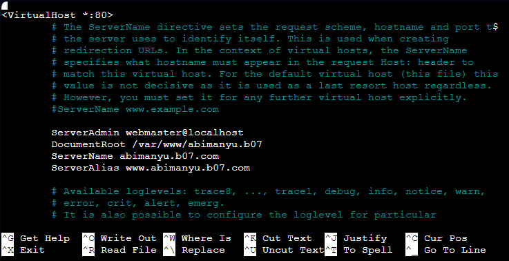

kemudian kita melakukan command
```
a2ensite abimanyu.b07.com
```
```
service apache2 restart
```

kemudian kita membuat directory yang akan diisi dengan website pada directory var/www
```
mkdir /var/www/abimanyu.b07
```

sebelum memindahkan pada folder yang sudah dibuat tersebut, kita melakukan download resource yang sudah disiapkan dengan command wget berikut
```
wget --no-check-certificate 'https://docs.google.com/uc?export=download&id=1a4V23hwK9S7hQEDEcv9FL14UkkrHc-Zc' -O abimanyu.b07.com.zip
```

lakukan download file tersebut pada root, agar file yang telah di download tidak hilang, dan tidak melakukan download ulang, kemudian lakukan unzip dengan
```
unzip abimanyu.b07.com
```

kemudian kita menjalankan command berikut untuk melakukan copy hasil download ke dalam folder web yang sudah kita buat
```
cp -v /root/abimanyu.yyy.com/* /var/www/abimanyu.b07/
```

kemudian kita lakukan coba melakukan akses pada client sadewa untuk menampilkan halaman dengan 
```
lynx www.abimanyu.b07.com
```

apabila keluar halaman seperti berikut, maka konfigurasi apache2 pada abimanyu sudah berhasil dilakukan

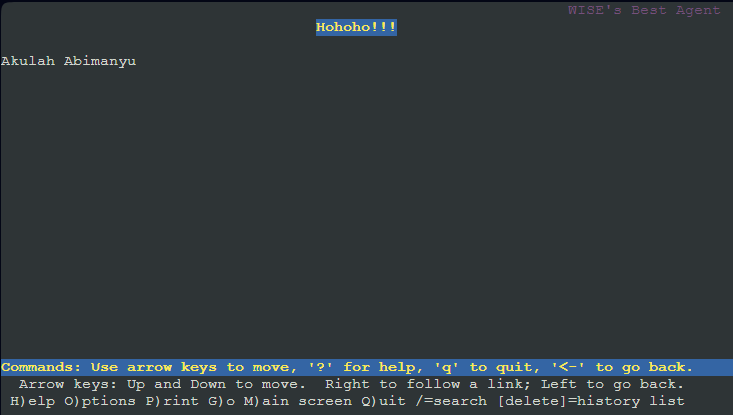

---
## SOAL 12
### Pertanyaan
Setelah itu ubahlah agar url www.abimanyu.yyy.com/index.php/home menjadi www.abimanyu.yyy.com/home.

### Solusi
untuk kasus kali ini kita melakukan rewrite pada penulisan url, pertama tama kita menjalankan perintah rewrite dengan
```
a2enmod rewrite
```

kemudian kita lakukan restart pada apache2 dengan
```
service apache2 restart
```

kemudian kita membuat file .htaccess pada folder yang ingin kita rewrite
```
touch /var/www/abimanyu.b07/.htaccess
```

kemudian tuliskan pada file `.htaccess` seperti berikut

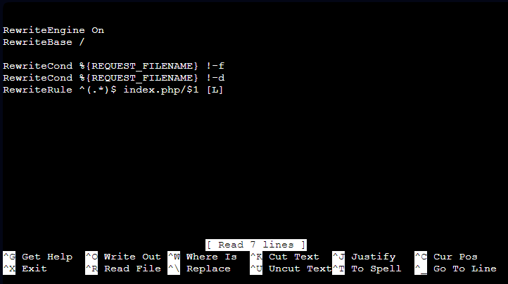

kemudian masukkan beberapa konfigurasi pada `/etc/apache2/sites-available/abimanyu.b07.com.conf` seperti berikut

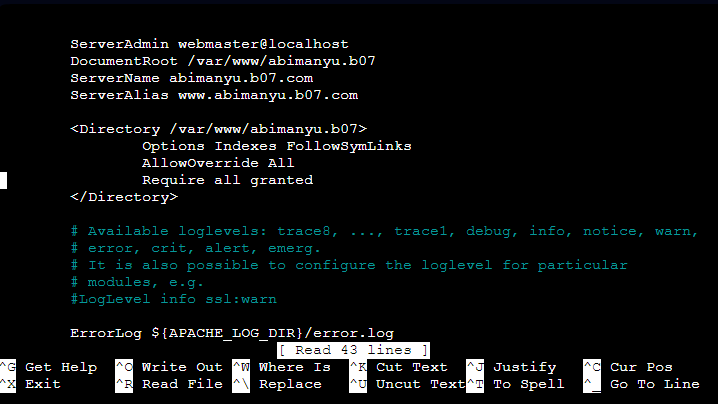

kemudian apabila dapat di akses menggunakan

```
lynx www.abimanyu.yyy.com/home
```
akan muncul page sebagai berikut 

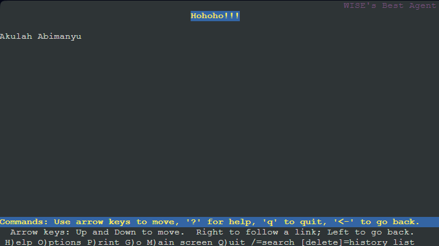

---
## SOAL 13
### Pertanyaan
Selain itu, pada subdomain www.parikesit.abimanyu.yyy.com, DocumentRoot disimpan pada /var/www/parikesit.abimanyu.yyy

### Solusi
pertama tama kita membuat file configurasi pada `sites-available` dengan menggunakan command 
```
cp /etc/apache2/sites-available/000-default.conf /etc/apache2/sites-available/parikesit.abimanyu.b07.com.conf
```

kemudian edit di dalam file tersebut menjadi seperti berikut 

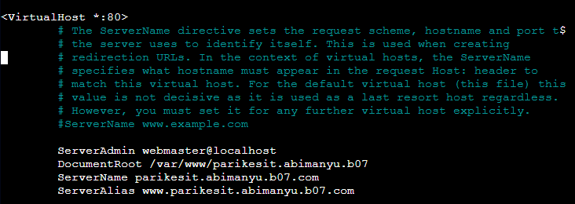

kemudian kita melakukan ensite seperti berikut 
```
a2ensite parikesit.abimanyu.b07.com
```

kemudian kita lakukan restart pada apache2 dengan
```
service apache2 restart
```

kemudian kita membuat directory yang akan diisi dengan website pada directory var/www
```
mkdir /var/www/parikesit.abimanyu.b07
```

sebelum memindahkan pada folder yang sudah dibuat tersebut, kita melakukan download resource yang sudah disiapkan dengan command wget berikut
```
wget --no-check-certificate 'https://docs.google.com/uc?export=download&id=1LdbYntiYVF_NVNgJis1GLCLPEGyIOreS' -O parikesit.abimanyu.b07.com.zip
```

lakukan download file tersebut pada root, agar file yang telah di download tidak hilang, dan tidak melakukan download ulang, kemudian lakukan unzip dengan
```
unzip parikesit.abimanyu.b07.com
```

kemudian kita menjalankan command berikut untuk melakukan copy hasil download ke dalam folder web yang sudah kita buat
```
cp -v /root/abimanyu.yyy.com/* /var/www/parikesit.abimanyu.b07/
```

kemudian kita lakukan coba melakukan akses pada client sadewa untuk menampilkan halaman dengan 
```
lynx parikesit.abimanyu.b07.com
```

apabila keluar halaman seperti berikut, maka konfigurasi apache2 pada abimanyu sudah berhasil dilakukan

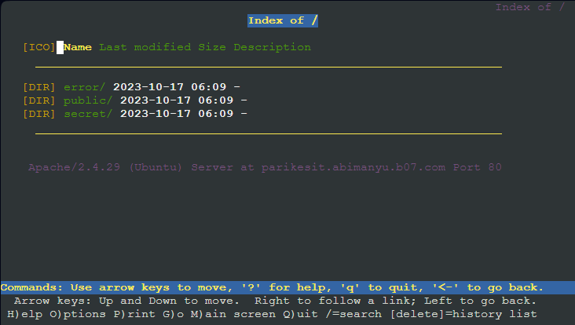

---
## SOAL 14
### Pertanyaan
Pada subdomain tersebut folder /public hanya dapat melakukan directory listing sedangkan pada folder /secret tidak dapat diakses (403 Forbidden).

### Solusi
pertama, kita membuat folder `secret` di dalam `/var/www/parikesit.abimanyu.b07` dengan menggunakan perintah berikut beserta membuat file htmlnya karena file tidak ada atau tidak disediakan.
```
mkdir /var/www/parikesit.abimanyu.b07/secret
```
```
touch /var/www/parikesit.abimanyu.b07/secret/secret.html
```

dan kita membuat isi dari `secret.html` secara sederhana sebagai berikut 

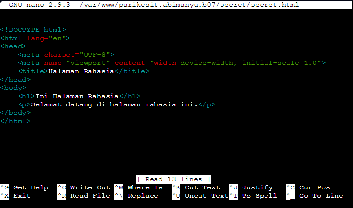

kemudian kita melakukan edit pada file konfigurasi di `/etc/apache2/sites-available/parikesit.abimanyu.b07.com.conf` dengan menambahkan sebagai berikut


karena yang diminta adalah public dapat melakukan listing namun pada secret tidak dapat melakukan listing sehingga akan muncul berikut apabila dilakukan akses pada secret

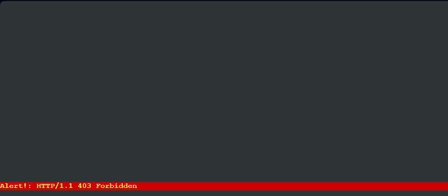
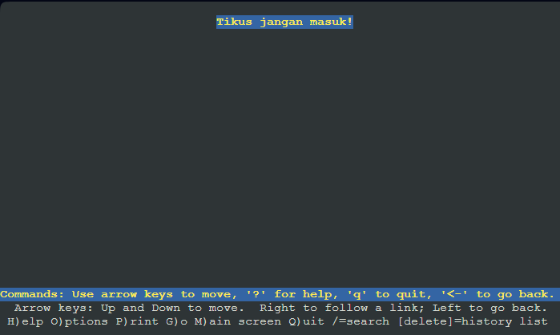

---
## SOAL 15
### Pertanyaan
Buatlah kustomisasi halaman error pada folder /error untuk mengganti error kode pada Apache. Error kode yang perlu diganti adalah 404 Not Found dan 403 Forbidden.

### Solusi
untuk nomor 15, kita hanya customisasi sedikit untuk ditambahkan pada konfigurasi, pertama akses pada `/etc/apache2/apache2.conf`

dengan menggunakan 

```
nano /etc/apache2/apache2.conf
```

kemudian tambahkan seperti berikut pada barisnya

```
ErrorDocument 404 /error/404.html
ErrorDocument 403 /error/403.html
```

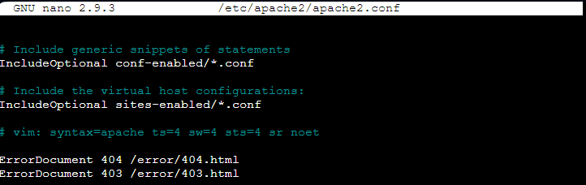

sehingga akan muncul error custom seperti pada nomor 14, atau seperti berikut


---
## SOAL 16
### Pertanyaan
Buatlah suatu konfigurasi virtual host agar file asset www.parikesit.abimanyu.yyy.com/public/js menjadi 
www.parikesit.abimanyu.yyy.com/js 

### Solusi
Peratama tama, caranya sangat sederhana kita harus menambahkan alias di node abimanyu `nano /etc/apache2/sites-available/parikesit.abimanyu.b07.com.conf`

```
Alias "/js" "/var/www/parikesit.abimanyu.b07/public/js"
```

kemudian kita hanya perlu membuka `lynx parikesit.abimanyu.b07.com/js` pada client


---
## SOAL 17
### Pertanyaan
Agar aman, buatlah konfigurasi agar www.rjp.baratayuda.abimanyu.yyy.com hanya dapat diakses melalui port 14000 dan 14400.

### Solusi
pertama tama, kita harus menambahkan konfigurasi pada `nano /etc/apache2/sites-available/rjp.baratayuda.abimanyu.b07.com.conf`

kemudian kita hanya perlu membuka `lynx www.rjp.baratayuda.abimanyu.b07.com:1400` atau `lynx www.rjp.baratayuda.abimanyu.b07.com:1440`  maka akan mengarah langsung ke website sedangkan jika diakses langsung tanpa port maka akan mengarah ke page default


---
## SOAL 18
### Pertanyaan
Untuk mengaksesnya buatlah autentikasi username berupa “Wayang” dan password “baratayudayyy” dengan yyy merupakan kode kelompok. Letakkan DocumentRoot pada /var/www/rjp.baratayuda.abimanyu.yyy.

### Solusi
pertama tama caranya username dan password harus disimpan ke /etc/apache2/.htpasswd menggunakan 
```
htpasswd -cb /etc/apache2/.htpasswd Wayang baratayudab07
```
kemudian pada file `nano /etc/apache2/sites-available/rjp.baratayuda.abimanyu.b07.com.conf` kita perlu menambahkan
```
<Directory /var/www/rjp.baratayuda.abimanyu.b07>
                AuthType Basic
                AuthName "Authentication Required"
                AuthUserFile /etc/apache2/.htpasswd
                Require valid-user
        </Directory>
```

kemudian kita hanya perlu memeriksa di client dengan `lynx www.rjp.baratayuda.abimanyu.b07.com` kita diminta untuk memasukan username Wayang dengan password baratayudab07 sehingga kita bisa mendapatkan akses masuk
kita diminta untuk mengisi username terlebih dahulu


kemudian kita diminta memasukan password


setelah berhasil maka akan masuk kedalam rjp


---
## SOAL 19
### Pertanyaan
Buatlah agar setiap kali mengakses IP dari Abimanyu akan secara otomatis dialihkan ke www.abimanyu.yyy.com (alias)
### Solusi
caranya tinggal tambahin  redirect permanent ke `nano abimanyu.b07.com.conf`
```
<VirtualHost *:80>
        ServerName 10.12.3.3
        Redirect permanent / http://www.abimanyu.b07.com/
</VirtualHost>
```
Selanjutnya kita bisa mencoba menjalankan `lynx 10.12.3.3` kalau sudah mengarah ke http artinya benar


---
## SOAL 20
### Pertanyaan
Karena website www.parikesit.abimanyu.yyy.com semakin banyak pengunjung dan banyak gambar gambar random, maka ubahlah request gambar yang memiliki substring “abimanyu” akan diarahkan menuju abimanyu.png.

### Solusi
Pertama-tama Abimanyu Jangan lupa untuk menjalankan perintah berikut agar dapat melakukan rewrite modul
```
a2enmod rewrite
```
Kemudian kita hanya perlu menambahkan perintah ini untuk melakuka rewrite pada parikesit.abimanyu.b07 pada `/var/www/parikesit.abimanyu.b07/.htaccess`
```
RewriteEngine On
RewriteCond %{REQUEST_URI} ^/public/images/(.*)(abimanyu)(.*\.(png|jpg))
RewriteCond %{REQUEST_URI} !/public/images/abimanyu.png
RewriteRule abimanyu http://parikesit.abimanyu.a09.com/public/images/abimanyu.png$1 [L,R=301]'
```
selanjutnya kita harus menambahkan konfigurasi pada `nano /etc/apache2/sites-available/parikesit.abimanyu.b07.com.conf`
```
<Directory /var/www/parikesit.abimanyu.b07>
        Options +FollowSymLinks -Multiviews
        AllowOverride All
</Directory>
```
selanjutnya kita hanya perlu memeriksa dengan cara 
```
lynx parikesit.abimanyu.b07.com/public/images/cobadulu-abimanyu.png
lynx parikesit.abimanyu.b07.com/public/images/abimanyu-hebat.jpg
```
hasilnya akan mengarah ke abimanyu.png


